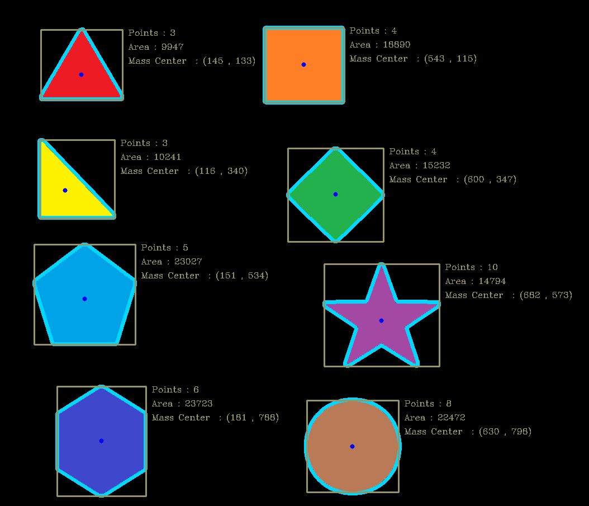
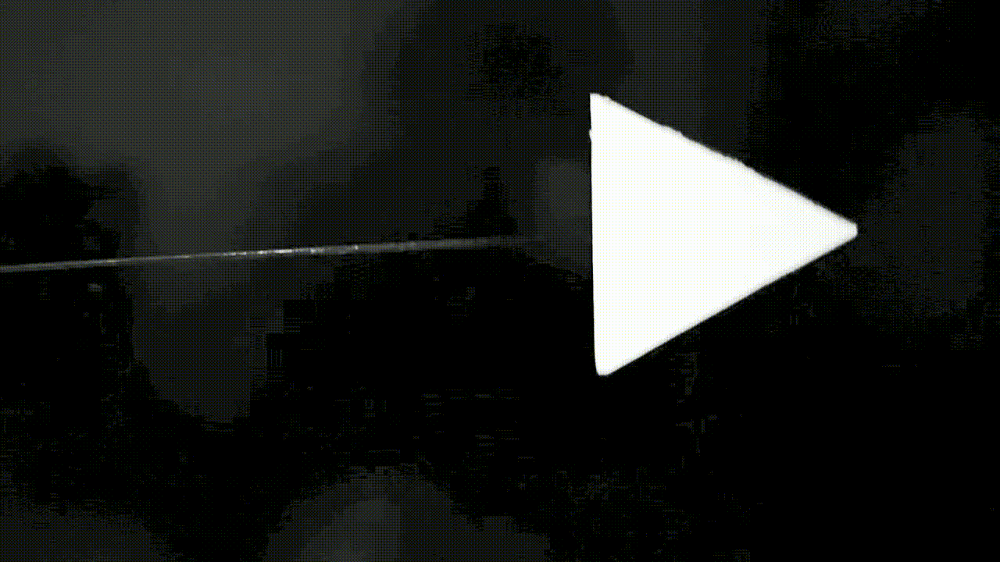
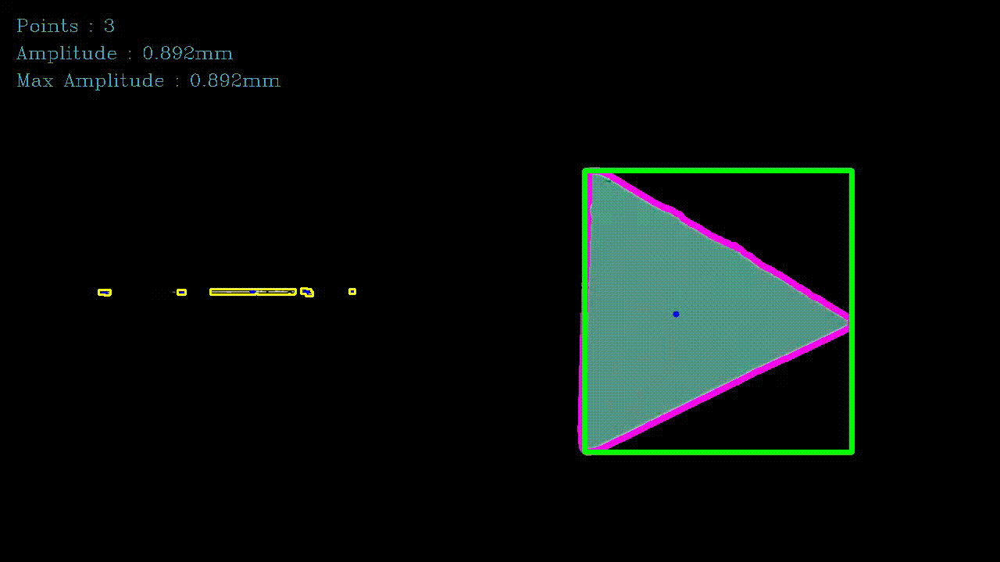

# Shape Detection

 

## Introduction
1. Find the outline of the object and detect shape.

2. Detects corner points and areas of the object shape.

3. Analyze the position of the center of gravity of an object.

 

## code

The code is performed in the following sequence:

1. Import video file and convert the from RGB to GrayScale.

2. Noise removal from video is eliminated with Gaussian Blur.

 

## Dependencies
* python

* opencv

 

## Sample output:

 
 
 
 
 
 

---
 
 
 
 
 
 

# Apply in **Energy Harvesting**

 

## 1. Wind Flow Energy Harvesting

* Vibration energy generated wind flow is
* Various aerodynamically phenomena occur depending on the cross-sectional shape of the bluff body, which has a great influence on energy harvesting efficiency.

 

## 2. Measure Amplitude

* The vibration system of the bluff body is analyzed to understand the aerodynamic phenomenon.

* Representatively, there is a method of measuring and analyzing the amplitude of a vibrating blur body with a laser sensor.

* However, other movements of the bluff body (slice, self-strain, etc.) cannot be analyzed.

* It is possible to visually analyze the appearance of the harvester while grasping the vibration system through the camera.

* Sample output:
    
    - This is a scene taken with a camera during an experiment in a real wind tunnel.
    - Connect the cantilever beam to the fixed jig inside the wind tunnel and attach the bluff body to the end.
    - The direction of the wind proceeds from right to left, and the bluff body vibrates by the wind and electricity can be extracted with a piezoelectric element attached to the beam.

    - original version
    

    - version with code
    